# APPLIED MACHINE LEARNING PROJECT - IA651
## LOAN APPROVAL PREDICTION USING MACHINE LEARNING
## Problem Statement
When customers apply for a loan, the financial companies assesses their eligibility based on various factors provided in the online application form. 

This problem involves classification, where the objective is to predict whether a loan application will be approved or rejected. 
## Data Source
The dataset used in this project was obtained from Kaggle.

<https://www.kaggle.com/code/vikasukani/loan-eligibility-prediction-machine-learning>

train.csv, 
test.csv
## Dataset description
This dataset contains information related to loan applications, with each row representing a single application. Here's an explanation of each column:

**Loan_ID:** Unique identifier for each loan application.

**Gender:** Gender of the applicant (Male or Female).

**Married:** Marital status of the applicant (Yes or No).

**Dependents:** Number of dependents of the applicant.

**Education:** Education level of the applicant (Graduate or Not Graduate).

**Self_Employed:** Indicates whether the applicant is self-employed (Yes or No).

**ApplicantIncome:** Income of the applicant.


**CoapplicantIncome:** Income of the co-applicant (if any).

**LoanAmount:** Amount of the loan applied for.

**Loan_Amount_Term:** Term of the loan in months.

**Credit_History:** Credit history of the applicant (1 for good credit history, 0 for bad credit history).

**Property_Area:** Type of property area where the applicant resides (Urban, Semiurban, or Rural).

**Loan_Status:** Indicates whether the loan application was approved (Y for Yes, N for No).

## Hypothesis
This stage involves identifying and listing all potential factors that could influence the outcome.

Here are some factors I think could matter in predicting loan approval:

**Education:** Maybe people with higher education levels are more likely to get approved.

**Income:** Perhaps applicants with higher incomes have a better chance.

**Previous history:** Those who've paid off debts reliably in the past might have an advantage.

**Loan amount:** Smaller loans might be easier to get approved.

**Loan term:** Shorter loan durations might lead to higher approval rates.

**EMI (Monthly Payments):** Lower monthly payments could mean higher chances of approval.

## Import all the necessary Libraries

```python
import pandas as pd
import numpy as np
import seaborn as sns
import matplotlib.pyplot as plt
from sklearn.preprocessing import LabelEncoder
from sklearn.model_selection import train_test_split, cross_val_score
from sklearn.linear_model import LogisticRegression
from sklearn.metrics import accuracy_score,precision_score, recall_score, f1_score, roc_auc_score
from sklearn.preprocessing import StandardScaler
from sklearn.model_selection import StratifiedGroupKFold
from sklearn import tree
from sklearn.ensemble import RandomForestClassifier
from xgboost import XGBClassifier # type: ignore
from sklearn import metrics
from sklearn.metrics import roc_curve, roc_auc_score
from sklearn.model_selection import cross_val_score
from sklearn.tree import DecisionTreeClassifier
from sklearn.ensemble import RandomForestClassifier
from sklearn.model_selection import GridSearchCV
from sklearn.ensemble import GradientBoostingClassifier
import dtale
```
# Loading the dataset

```python
train = pd.read_csv("train.csv")
test = pd.read_csv("test.csv")
```
**train.csv:**

This file contains the training data for the model.

It includes all the independent variables along with the target variable.

**test.csv:**

This file contains the test data.

It includes only the independent variables, without the target variable.
## Exploratory Data Analysis

```python
train.describe().transpose()
```
```python
dtale.show(train)
```
It is the easiest form of analyzing data where we can analyze our data by look into summary, visualize,duplicates,missing,correlation,etc in one place.
As we recently came to know about this dtale, We still like to explore more,We continued with our normal analysis method.
```python

```
```python
train.columns
```
We have 12 independent variables and 1 target variable i.e. Loan_Status
```python
test.columns
```
We have similar features in the test dataset as the training dataset except for the Loan_Status. We will predict the Loan_Status using the model built.
```python
train.head()
```

```python
train.shape
```
(614, 13)

```python
test.shape
```
(367, 12)

```python
train.info()
```
```python
<class 'pandas.core.frame.DataFrame'>
RangeIndex: 614 entries, 0 to 613
Data columns (total 13 columns):
 #   Column             Non-Null Count  Dtype  
---  ------             --------------  -----  
 0   Loan_ID            614 non-null    object 
 1   Gender             601 non-null    object 
 2   Married            611 non-null    object 
 3   Dependents         599 non-null    object 
 4   Education          614 non-null    object 
 5   Self_Employed      582 non-null    object 
 6   ApplicantIncome    614 non-null    int64  
 7   CoapplicantIncome  614 non-null    float64
 8   LoanAmount         592 non-null    float64
 9   Loan_Amount_Term   600 non-null    float64
 10  Credit_History     564 non-null    float64
 11  Property_Area      614 non-null    object 
 12  Loan_Status        614 non-null    object 
dtypes: float64(4), int64(1), object(8)
memory usage: 62.5+ KB
```

## Univariate Analysis
```python
train['Loan_Status'].value_counts()
```
```python
Loan_Status
Y    422
N    192
Name: count, dtype: int64
```

```python
train['Loan_Status'].value_counts(normalize=True)
```
```python
Loan_Status
Y    0.687296
N    0.312704
Name: proportion, dtype: float64
```
```python
train['Loan_Status'].value_counts().plot.bar()
```
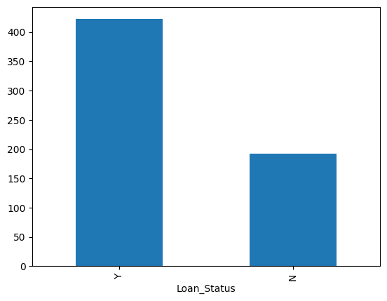
Nearly 422 people got approval out of 614.
## Visualize the categorical features
```python
fig, axs = plt.subplots(2, 2, figsize=(10, 8))

train['Gender'].value_counts(normalize=True).plot.bar(ax = axs[0, 0], title='Gender Distribution')
train['Married'].value_counts(normalize=True).plot.bar(ax = axs[0, 1], title='Married Distribution')
train['Self_Employed'].value_counts(normalize=True).plot.bar(ax = axs[1, 0], title='Self_Employed')
train['Credit_History'].value_counts(normalize=True).plot.bar(ax = axs[1, 1], title='Credit_History')

plt.tight_layout()
plt.show()
```
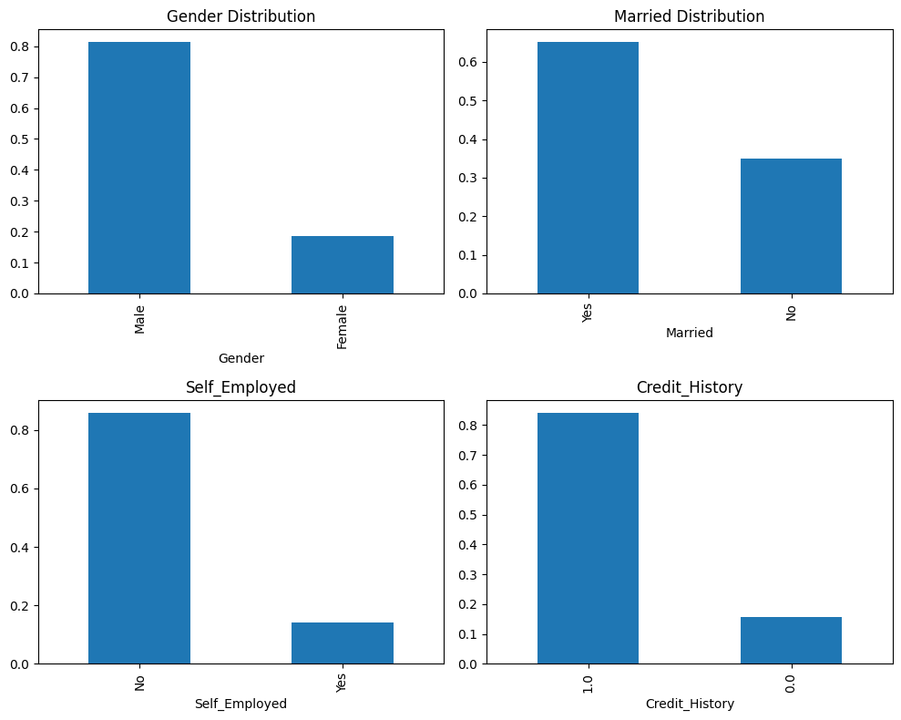
The bar plots indicate the following insights:

Approximately 80% of the dataset's applicants are male.

Roughly 65% of the dataset's applicants are married.

Self-employed individuals make up about 15% of the  applicants.

Around 85% of the applicants have repaid their debts.
## VISUALIZE THE ORDINAL FEATURES

```python
train['Education'].value_counts(normalize=True).plot.bar(figsize=(5,4),title='Education')
```
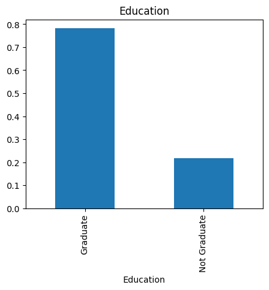
80% of the applicants are graduates.
```python
fig, axs = plt.subplots(1, 2, figsize=(10, 5))

train['Dependents'].value_counts(normalize=True).plot.bar(ax = axs[0], title='Dependents')
train['Property_Area'].value_counts(normalize=True).plot.bar(ax = axs[1], title='Property_Area')

plt.tight_layout()
plt.show()
```
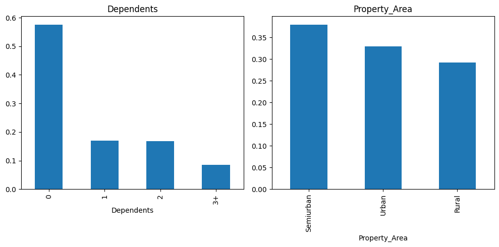
Most of the applicants don’t have dependents.

Most of the applicants are from semi-urban areas.

## VISUALIZE THE NUMERICAL FEATURES

```python
#Visualize Numerical Variables
fig, axs = plt.subplots(1, 2, figsize=(12, 5))
sns.histplot(train['ApplicantIncome'], ax = axs[0])
axs[0].set_title('Applicant Income Distribution')

train['ApplicantIncome'].plot.box(ax = axs[1])
axs[1].set_title('Applicant Income Boxplot')

plt.tight_layout()
plt.show()
```
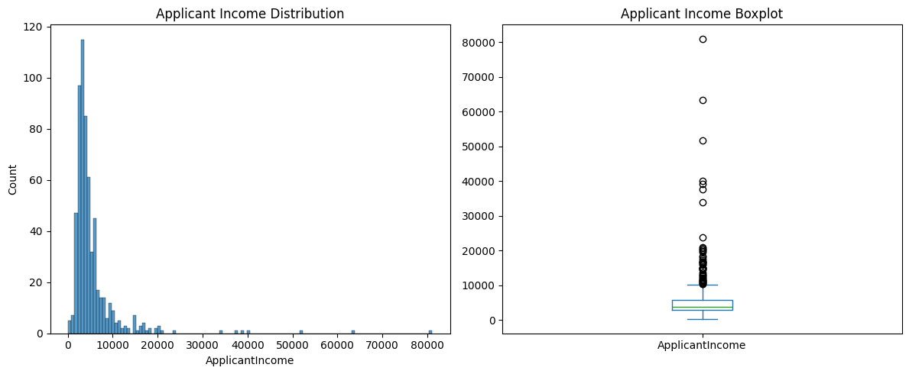
The distribution of applicant income indicates that the majority of the data is skewed towards the left, suggesting a non-normal distribution. To enhance model performance, we'll aim to normalize this distribution in subsequent sections, as algorithms tend to perform better with normally distributed data.

There are outliers observed in this variable
```python
fig, axs = plt.subplots(1, 2, figsize=(12, 5))
sns.histplot(train['LoanAmount'], ax = axs[0])
axs[0].set_title('Loan Amount Distribution')

train['LoanAmount'].plot.box(ax = axs[1])
axs[1].set_title('Loan Amount Boxplot')

plt.tight_layout()
plt.show()
```
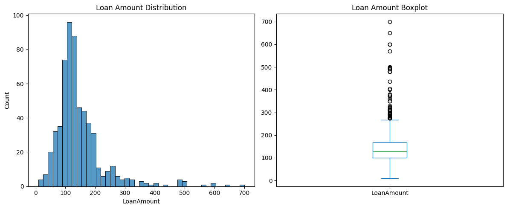

There are numerous outliers observed in this variable, although the distribution appears to be fairly normal. We'll treat the outliers.
## Bivariate Analysis
Let's check our hypotheses with bivariate analysis. After looking at each variable alone, we'll now explore them again in relation to the target variable.
## Categorical Independent Variable Vs Target Variable
```python
fig, axs = plt.subplots(3, 3, figsize=(15, 12))
Gender = pd.crosstab(train['Gender'], train['Loan_Status'])
Gender.div(Gender.sum(1).astype(float), axis=0).plot(kind="bar", ax=axs[0, 0], title='Gender')
Married = pd.crosstab(train['Married'], train['Loan_Status'])
Married.div(Married.sum(1).astype(float), axis=0).plot(kind="bar", ax=axs[0, 1], title='Married')
Dependents = pd.crosstab(train['Dependents'], train['Loan_Status'])
Dependents.div(Dependents.sum(1).astype(float), axis=0).plot(kind="bar", ax=axs[0, 2], title='Dependents')
Education = pd.crosstab(train['Education'], train['Loan_Status'])
Education.div(Education.sum(1).astype(float), axis=0).plot(kind="bar", ax=axs[1, 0], title='Education')
Self_Employed = pd.crosstab(train['Self_Employed'], train['Loan_Status'])
Self_Employed.div(Self_Employed.sum(1).astype(float), axis=0).plot(kind="bar", ax=axs[1, 1], title='Self Employed')
Credit_History = pd.crosstab(train['Credit_History'], train['Loan_Status'])
Credit_History.div(Credit_History.sum(1).astype(float), axis=0).plot(kind="bar", ax=axs[1, 2], title='Credit History')
Property_Area = pd.crosstab(train['Property_Area'], train['Loan_Status'])
Property_Area.div(Property_Area.sum(1).astype(float), axis=0).plot(kind="bar", ax=axs[2, 0], title='Property Area')
axs[2, 1].axis('off')
axs[2, 2].axis('off')

plt.tight_layout()
plt.show()
```
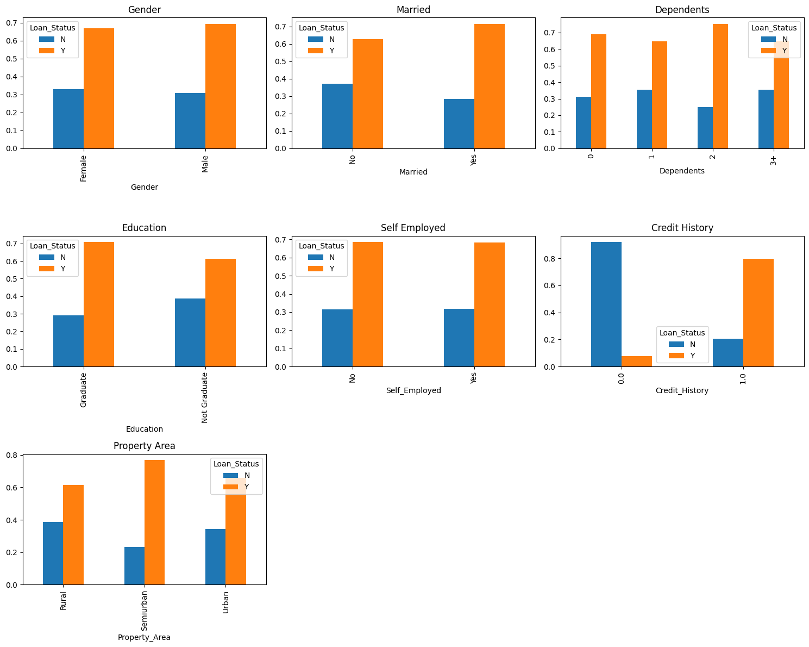

It seems that the proportion of male and female applicants is similar for both approved and unapproved loans.

More married applicants seem to get approved for loans. 

The number of dependents doesn't show a clear difference between approved and unapproved loans.

The Self_Employed status doesn't seem to have a significant impact on loan approval.

People who have a credit history of 1 are more likely to get their loans approved.

More loans are approved in semi-urban areas compared to rural or urban areas.
## Visualize Numerical Independent Variable Vs Target Variable
###### Trying to find the mean income of people for which the loan has been approved Vs rejected


```python
train.groupby('Loan_Status')['ApplicantIncome'].mean().plot.bar()
```
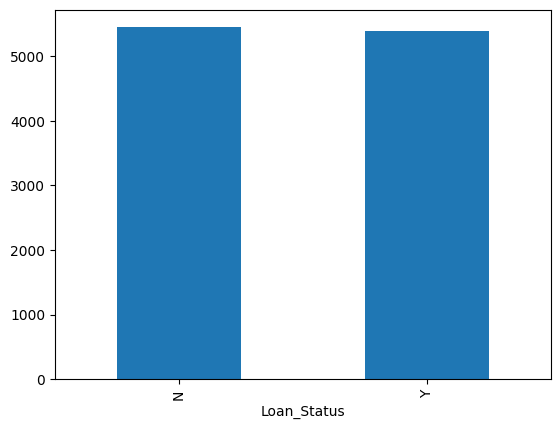
Here, the y-axis shows the applicant income. 

We don't notice any difference in the average income. So, let's group the applicant income into bins based on their values and analyze the loan status for each bin.

```python
# Set up subplots
fig, axes = plt.subplots(2, 2, figsize=(15, 10))

# Applicant Income bins Vs Loan Status
bins = [0, 2000, 4000, 6000, 81000]
group = ['Low', 'Average', 'High', 'Very High']
train['Income_bin'] = pd.cut(train['ApplicantIncome'], bins, labels=group)
Income_bin = pd.crosstab(train['Income_bin'], train['Loan_Status'])
Income_bin.div(Income_bin.sum(1).astype(float), axis=0).plot(kind="bar", ax=axes[0, 0], rot=0)
axes[0, 0].set_xlabel('ApplicantIncome')
axes[0, 0].set_ylabel('Percentage')

# Coapplicant Income bins Vs Loan Status
bins = [0, 1000, 3000, 42000]
group = ['Low', 'Average', 'High']
train['Coapplicant_Income_bin'] = pd.cut(train['CoapplicantIncome'], bins, labels=group)
Coapplicant_Income_bin = pd.crosstab(train['Coapplicant_Income_bin'], train['Loan_Status'])
Coapplicant_Income_bin.div(Coapplicant_Income_bin.sum(1).astype(float), axis=0).plot(kind="bar", ax=axes[0, 1], rot=0)
axes[0, 1].set_xlabel('CoapplicantIncome')
axes[0, 1].set_ylabel('Percentage')

# Total Income Vs Loan_status
train['Total_Income'] = train['ApplicantIncome'] + train['CoapplicantIncome']
bins = [0, 2000, 4000, 6000, 81000]
group = ['Low', 'Average', 'High', 'Very High']
train['Total_Income_bin'] = pd.cut(train['Total_Income'], bins, labels=group)
Total_Income_bin = pd.crosstab(train['Total_Income_bin'], train['Loan_Status'])
Total_Income_bin.div(Total_Income_bin.sum(1).astype(float), axis=0).plot(kind="bar", ax=axes[1, 0], rot=0)
axes[1, 0].set_xlabel('Total_Income')
axes[1, 0].set_ylabel('Percentage')

# Visualize Loan Amount Variable
bins = [0, 100, 200, 700]
group = ['Low', 'Average', 'High']
train['LoanAmount_bin'] = pd.cut(train['LoanAmount'], bins, labels=group)
LoanAmount_bin = pd.crosstab(train['LoanAmount_bin'], train['Loan_Status'])
LoanAmount_bin.div(LoanAmount_bin.sum(1).astype(float), axis=0).plot(kind="bar", ax=axes[1, 1], rot=0)
axes[1, 1].set_xlabel('LoanAmount')
axes[1, 1].set_ylabel('Percentage')

plt.tight_layout()
plt.show()
```
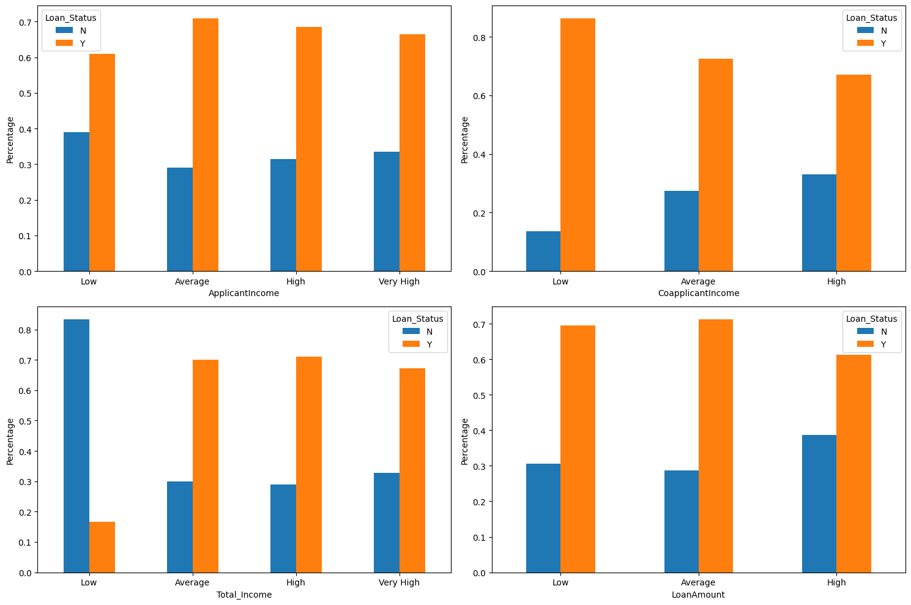
It seems that applicant income alone doesn't have much impact on loan approval, which goes against our initial assumption that higher income would lead to higher approval rates.

For co-applicant income, it appears that having lower income might increase the chances of loan approval. However, this might not be accurate since many applicants don't have a co-applicant, resulting in a reported income of zero. To address this, we created a new variable by combining both applicant and co-applicant incomes to better understand their combined effect on loan approval.

When we look at the total income, we notice that loans with lower total income have a lower approval rate compared to those with average, high, or very high income.

Additionally, for loan amounts, we observe that loans with lower and average amounts have higher approval rates compared to those with high amounts. This aligns with our hypothesis that lower loan amounts would have higher approval chances.
# DATA PREPROCESSING
```python
# Drop unnecessary columns
train = train.drop(['Income_bin', 'Coapplicant_Income_bin', 'LoanAmount_bin', 'Total_Income_bin', 'Total_Income'], axis=1)
```
```python
# Replace values in columns
train['Dependents'] = train['Dependents'].replace('3+', 3)
test['Dependents'] = test['Dependents'].replace('3+', 3)
```
### Correlation Heatmap of all the numerical variables

```python
numeric_columns = train.select_dtypes(include=['float64','int64'])

plt.figure(figsize=(8, 6))
sns.heatmap(numeric_columns.corr(), annot=True, cmap='coolwarm', fmt=".2f")
plt.title('Correlation Matrix')
plt.show()
```
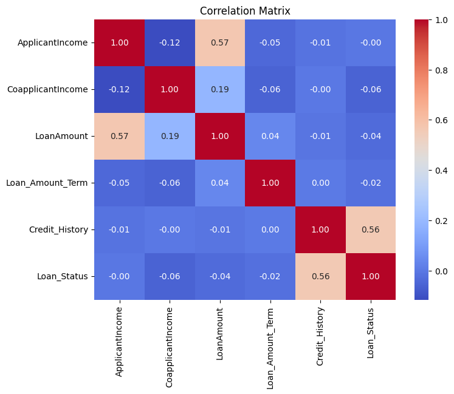
It's evident that the most correlated variables are ApplicantIncome with LoanAmount and Credit_History with Loan_Status. Additionally, LoanAmount shows some correlation with CoapplicantIncome.
## Finding Missing Values 
```python
train.isnull().sum()
```
```python
Loan_ID               0
Gender               13
Married               3
Dependents           15
Education             0
Self_Employed        32
ApplicantIncome       0
CoapplicantIncome     0
LoanAmount           22
Loan_Amount_Term     14
Credit_History       50
Property_Area         0
Loan_Status           0
dtype: int64
```
The columns Gender, Married, Dependents, Self_Employed, LoanAmount, Loan_Amount_Term, and Credit_History contain missing values.
## Imputation
### Categorcal Variables: mode

```python
columns_to_fill = ['Gender', 'Married', 'Dependents', 'Self_Employed', 'Credit_History']

for col in columns_to_fill:
    train[col] = train[col].fillna(train[col].mode()[0])
```
### Numerical Variables: mean or median
```python
train['Loan_Amount_Term'] = train['Loan_Amount_Term'].fillna(train['Loan_Amount_Term'].mode()[0])
```
#### Loan Amount have outliers so we are using median to fill
```python
train['LoanAmount'] = train['LoanAmount'].fillna(train['LoanAmount'].median())
```
Since it is a numerical variable, we have the option to use either the mean or median to fill in the missing values. Considering that "loan amount" contains outliers, we'll use the median to address the null values. This decision avoids the influence of outliers, which can significantly impact the mean.
```python
train.isnull().sum()
```
```python
Loan_ID              0
Gender               0
Married              0
Dependents           0
Education            0
Self_Employed        0
ApplicantIncome      0
CoapplicantIncome    0
LoanAmount           0
Loan_Amount_Term     0
Credit_History       0
Property_Area        0
Loan_Status          0
dtype: int64
```
## Fill missing value in test data too

```python
columns_fill = ['Gender', 'Married', 'Dependents', 'Self_Employed', 'Credit_History']

for col in columns_fill:
    test[col] = test[col].fillna(test[col].mode()[0])
```
```python
test['Loan_Amount_Term'] = test['Loan_Amount_Term'].fillna(test['Loan_Amount_Term'].mode()[0])
test['LoanAmount'] = test['LoanAmount'].fillna(test['LoanAmount'].median())
test.isnull().sum()
```
```python
Loan_ID              0
Gender               0
Married              0
Dependents           0
Education            0
Self_Employed        0
ApplicantIncome      0
CoapplicantIncome    0
LoanAmount           0
Loan_Amount_Term     0
Credit_History       0
Property_Area        0
dtype: int64
```
## Outliers Treatment
```python
train['LoanAmount_log'] = np.log(train['LoanAmount'])
train['LoanAmount_log'].hist(bins=20)
test['LoanAmount_log'] = np.log(test['LoanAmount'])
```
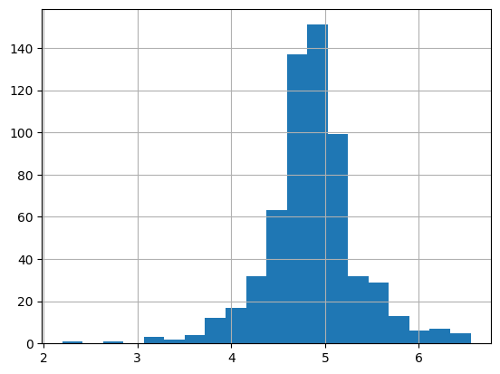
Because of outliers, the majority of the loan amount data is concentrated on the left side, resulting in a longer right tail, it is known as right skewness. 

One method to mitigate skewness is by applying the log transformation. When we apply the log transformation, it has a minimal effect on smaller values but diminishes larger values.

Consequently, we achieve a distribution that resembles the normal distribution.

Now, with the distribution appearing much closer to normal and the impact of extreme values greatly reduced, let's proceed to construct a logistic regression model and generate predictions for the test dataset.

## X and y Variables
```python
X = train.drop(columns=['Loan_Status'])
y = train['Loan_Status']
```
we will drop our target variable from the training dataset and save it in another dataset X.

Saving only target varible in y.
# Feature Engineering
### Removing unwanted Features
```python
train = train.drop('Loan_ID',axis=1)
test = test.drop('Loan_ID',axis=1)
```
We can remove the Loan_ID variable as it doesn't influence the loan status
## Label Encoding
```python
train['Loan_Status'] = train['Loan_Status'].map({'N': 0, 'Y': 1})
```
## One-hot encode categorical variables
```python
X = pd.get_dummies(X)
train = pd.get_dummies(train)
test = pd.get_dummies(test)
```
Create dummy variables for the categorical variables. Dummy variables transform categorical variables into a series of 0s and 1s, simplifying their quantification and comparison.
## Scaling
```python
# Z-Score normalization(mean 0,sd 1)
scaler = StandardScaler()
X_train_scaled = scaler.fit_transform(X_train)
X_cv_scaled = scaler.transform(X_cv)
```
Earlier I applied log transformation to variables with outliers. Log transformation helps mitigate the impact of extreme values by compressing the range of values, making the distribution more symmetric and improving the model's performance, especially for algorithms sensitive to outliers.

Additionally, scaling was performed to ensure that all features contribute equally to the model training process. Scaling standardizes the range of features, preventing variables with larger magnitudes from dominating the model training. This enhances the stability and convergence of algorithms like logistic regression, support vector machines, and k-nearest neighbors, ultimately leading to better predictive performance.
# Modeling
## Split our dataset into train and validation parts
```python
X_train, X_cv, y_train, y_cv = train_test_split(X,y, test_size=0.3, random_state=42)
```
The dataset is split into training and validation sets.
## 1. Logistic Regression
```python
model = LogisticRegression(max_iter = 10000)
model.fit(X_train_scaled, y_train)

pred_cv = model.predict(X_cv_scaled)
```
fit the logistic regression model.predicted the Loan_Status for the validation set and will calculate its accuracy,etc.
## Evaluation
```python
accuracy = accuracy_score(y_cv,pred_cv)
precision = precision_score(y_cv,pred_cv)
recall = recall_score(y_cv,pred_cv)
f1 = f1_score(y_cv,pred_cv)
roc_auc = roc_auc_score(y_cv,pred_cv)

print("Accuracy:", accuracy)
print("Precision:", precision)
print("Recall:", recall)
print("F1 Score:", f1)
print("ROC AUC Score:",roc_auc)
```
```python
Accuracy: 0.7837837837837838
Precision: 0.7564102564102564
Recall: 0.9833333333333333
F1 Score: 0.855072463768116
ROC AUC Score: 0.6993589743589743
```
**Accuracy**: This metric indicates the proportion of correctly predicted outcomes out of the total predictions. In our case, approximately 78.38% of the predictions were correct.

- **Precision**: Precision measures the proportion of true positive predictions out of all positive predictions made by the model. Our model achieved a precision score of approximately 75.64%, implying that when it predicts a loan approval, it is correct about 75.64% of the time.

- **Recall**: Also known as sensitivity, recall measures the proportion of actual positive cases that were correctly predicted by the model. Our model demonstrated a recall score of about 98.33%, indicating that it identified around 98.33% of the actual positive cases.

- **F1 Score**: The F1 score is the harmonic mean of precision and recall, providing a balance between the two metrics. With an F1 score of approximately 85.51%, our model exhibits good overall performance.

- **ROC AUC Score**: This score represents the area under the receiver operating characteristic (ROC) curve, reflecting the model's ability to distinguish between positive and negative classes. Our model achieved a ROC AUC score of around 0.70, suggesting moderate discriminatory power.

These results indicate that our logistic regression model performs reasonably well, particularly in terms of recall and F1 score. However, there may be opportunities for further optimization to improve precision and ROC AUC score.
## Prediction for our test dataset
```python
pred_test = model.predict(test.values)
print(pred_test)
```
predictions for the test dataset.

```python
[0 0 0 0 0 0 0 0 0 0 0 0 0 0 0 0 0 0 0 0 0 0 0 0 0 0 0 0 0 0 0 0 0 0 0 0 0
 0 0 0 0 0 0 0 0 0 0 0 0 0 0 0 0 0 0 0 0 0 0 0 0 0 0 0 0 0 0 0 0 0 0 0 0 0
 0 0 0 0 0 0 0 0 0 0 0 0 0 0 0 0 0 0 0 0 0 0 0 0 0 0 0 0 0 0 0 0 0 0 0 0 0
 0 0 0 0 0 0 0 0 0 0 0 0 0 0 0 0 0 0 0 0 0 0 0 0 0 0 0 0 0 0 0 0 0 0 0 0 0
 0 0 0 0 0 0 0 0 0 0 0 0 0 0 0 0 0 0 0 0 0 0 0 0 0 0 0 0 0 0 0 0 0 0 0 0 0
 0 0 0 0 0 0 0 0 0 0 0 0 0 0 0 0 0 0 0 0 0 0 0 0 0 0 0 0 0 0 0 0 0 0 0 0 0
 0 0 0 0 0 0 0 0 0 0 0 0 0 0 0 0 0 0 0 0 0 0 0 0 0 0 0 0 0 0 0 0 0 0 0 0 0
 0 0 0 0 0 0 0 0 0 0 0 0 0 0 0 0 0 0 0 0 0 0 0 0 0 0 0 0 0 0 0 0 0 0 0 0 0
 0 0 0 0 0 0 0 0 0 0 0 0 0 0 0 0 0 0 0 0 0 0 0 0 0 0 0 0 0 0 0 0 0 0 0 0 0
 0 0 0 0 0 0 0 0 0 0 0 0 0 0 0 0 0 0 0 0 0 0 0 0 0 0 0 0 0 0 0 0 0 0]
```
bias/underfitting/imbalance
```python
from sklearn.metrics import confusion_matrix

# Confusion Matrix
conf_matrix = confusion_matrix(y_cv, pred_cv)
print("Confusion Matrix:")
print(conf_matrix)

# Additional Metrics
specificity = conf_matrix[0, 0] / (conf_matrix[0, 0] + conf_matrix[0, 1])
f2_score = (5 * precision * recall) / (4 * precision + recall)

print("Specificity:", specificity)
print("F2 Score:", f2_score)
```

```python
Confusion Matrix:
[[ 27  38]
 [  2 118]]
Specificity: 0.4153846153846154
F2 Score: 0.9276729559748427
```
The **confusion matrix** helps us understand how well our model is performing. In our case:

- 27 loan applications were correctly predicted as not approved.
- 38 loan applications were incorrectly predicted as not approved.
- 2 loan applications were incorrectly predicted as approved.
- 118 loan applications were correctly predicted as approved.

**Specificity** tells us how good our model is at identifying non-approved loan applications. A specificity of 0.415 means that our model correctly identified 41.5% of the non-approved loan applications.

**F2 score** combines precision and recall, giving more weight to recall. Our F2 score of 0.928 indicates that our model performs well in predicting approved loan applications while considering the importance of identifying them correctly.
# 2. Logistic Regression Using k-fold cross-validation
```python
cv_scores = cross_val_score(model,X_train_scaled, y_train, cv=5)
print("Cross-validation scores:", cv_scores)
print("Mean CV Score:", cv_scores.mean())
```

```python
Cross-validation scores: [0.8372093  0.81395349 0.8255814  0.81395349 0.78823529]
Mean CV Score: 0.8157865937072504
```
**Cross-validation** helps us evaluate our model's performance by splitting the data into multiple subsets, training the model on some and testing it on others. Here are the cross-validation scores we obtained:

- CV Score 1: 83.7%
- CV Score 2: 81.4%
- CV Score 3: 82.6%
- CV Score 4: 81.4%
- CV Score 5: 78.8%

**mean cross-validation score**, which averages these scores, is approximately **81.6%**. This gives us a good estimate of how well our model might perform on unseen data.

Let us visualize the roc curve.
## Visualize the roc curve
## Predict the probabilities of the validation set
```python

probs = model.predict_proba(X_cv_scaled)[:, 1]
# Calculate the False positive rate and True positive rate
fpr, tpr, _ = metrics.roc_curve(y_cv, probs)

#plot the roc curve
plt.figure(figsize=(8,6))
plt.plot(fpr, tpr, label='ROC curve (AUC = {:.2f})'.format(roc_auc_score(y_cv, probs)))
plt.plot([0, 1], [0, 1], linestyle='--', color='red',label='Random')
plt.xlabel('False Positive Rate')
plt.ylabel('True Positive Rate')
plt.title('Receiver Operating Characteristic (ROC) Curve')
plt.legend()
plt.show()
```
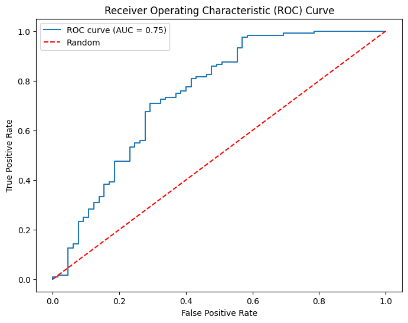
It is generally a better approach when dealing with both bias and variance.

We got an AUC value of 0.77.

Generally, an AUC above 0.8 is considered good, while below 0.7 may indicate that the model needs improvement.
##  Adding few new features
```python
# Total Income
train['Total_Income']=train['ApplicantIncome']+train['CoapplicantIncome']
test['Total_Income']=test['ApplicantIncome']+test['CoapplicantIncome']
sns.displot(train['Total_Income'])
```
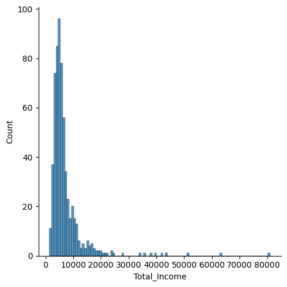
The distribution is right Skewed, log transformation to make normal distribution
```python
train['Total_Income_log'] = np.log(train['Total_Income'])
sns.displot(train['Total_Income_log'])
test['Total_Income_log'] = np.log(test['Total_Income'])
```
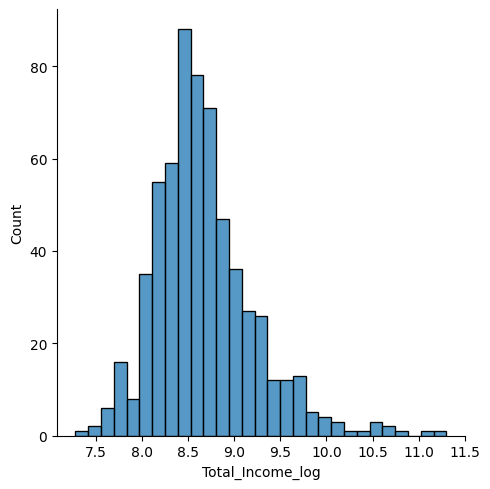
Now, the distribution closely resembles a normal distribution, and the impact of extreme values has notably diminished.

```python
#EMI
train['EMI']=train['LoanAmount']+train['Loan_Amount_Term']
test['EMI']=test['LoanAmount']+test['Loan_Amount_Term']
sns.displot(train['EMI'])
```
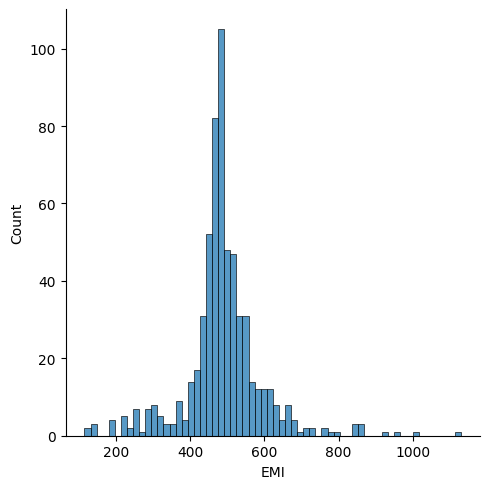

```python
# Balance Income
train['Balance_Income'] = train['Total_Income']-(train['EMI']*1000) #Multiply with 1000 to make the units equal
test['Balance_Income'] = test['Total_Income']-(test['EMI']*1000)
sns.displot(train['Balance_Income'])
```
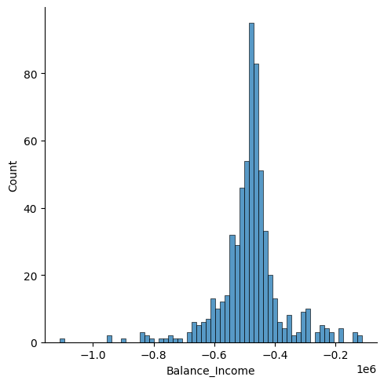
Drop the old varibles, to remove noise by removing correlated feature.

Correlation between old and new feature will be high,logistic regression assumes that the varibales are not highly correlated
```python

train = train.drop(['ApplicantIncome', 'CoapplicantIncome', 'LoanAmount',
       'Loan_Amount_Term'],axis=1)
test = test.drop(['ApplicantIncome', 'CoapplicantIncome', 'LoanAmount',
       'Loan_Amount_Term'],axis=1)
```
# Correlation Heatmap of all the numerical variables including new
```python
numeric_columns = train.select_dtypes(include=['float64','int64','bool'])

plt.figure(figsize=(15, 10))
sns.heatmap(numeric_columns.corr(), annot=True, cmap='coolwarm', fmt=".2f")
plt.title('Correlation Matrix')
plt.show()
```
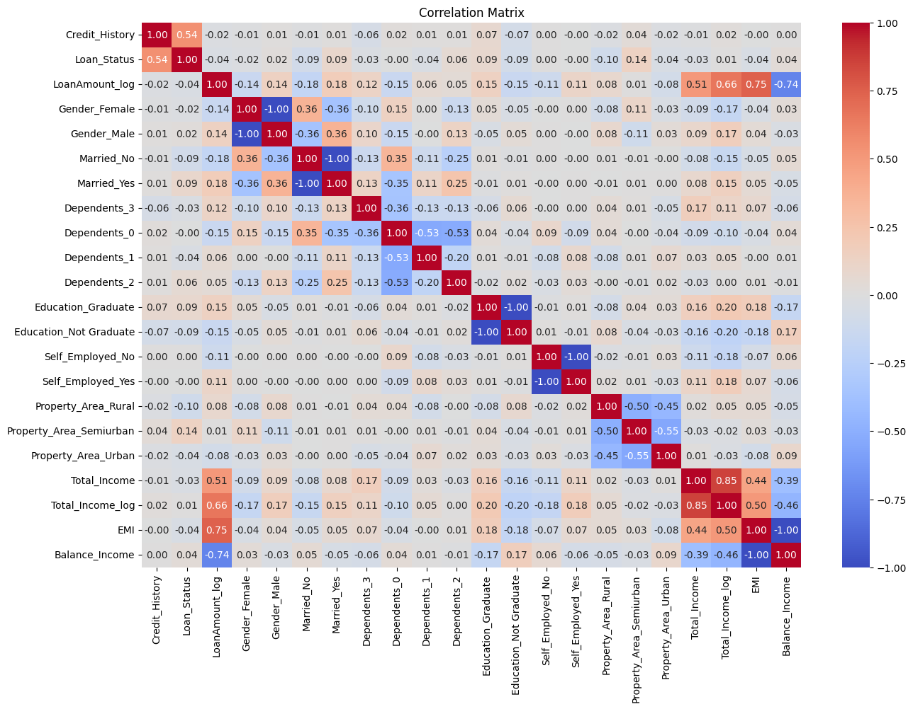
# Model 2. Decision Tree Model
```python

X = train.drop(columns=['Loan_Status'])
y = train['Loan_Status']
# Split our dataset into training and validation parts
X_train, X_cv, y_train, y_cv = train_test_split(X,y, test_size=0.3, random_state=42)
model = DecisionTreeClassifier(random_state=1)

# Scaling
scaler = StandardScaler()
X_train_scaled = scaler.fit_transform(X_train)
X_cv_scaled = scaler.transform(X_cv)
model.fit(X_train_scaled, y_train)
pred_cv = model.predict(X_cv_scaled)
accuracy = accuracy_score(y_cv,pred_cv)
precision = precision_score(y_cv,pred_cv)
recall = recall_score(y_cv,pred_cv)
f1 = f1_score(y_cv,pred_cv)
roc_auc = roc_auc_score(y_cv,pred_cv)

print("Accuracy:", accuracy)
print("Precision:", precision)
print("Recall:", recall)
print("F1 Score:", f1)
print("ROC AUC Score:",roc_auc)
#Prediction for our test dataset
pred_test = model.predict(test.values)
```
Again we did scaling because now we added new features.
```python
Accuracy: 0.7243243243243244
Precision: 0.776
Recall: 0.8083333333333333
F1 Score: 0.7918367346938775
ROC AUC Score: 0.6887820512820513
```
## Cross Validation Scores
```python
model = DecisionTreeClassifier(random_state=1)
cv_scores = cross_val_score(model, X, y, cv=5)
print("Cross-validation scores:", cv_scores)
print("Mean CV Score:", cv_scores.mean())

model.fit(X, y) # Fit the model with entire dataset
pred_test = model.predict(test) # Make prediction on the test dataset
```
```python
Cross-validation scores: [0.67479675 0.7398374  0.64227642 0.78861789 0.68032787]
Mean CV Score: 0.7051712648274023
```
```python
print(pred_test)
```
```python
[1 0 1 1 0 1 1 0 0 1 1 0 1 1 1 0 1 0 0 1 1 1 1 1 1 1 1 1 1 1 1 1 1 1 1 0 1
 1 1 1 1 1 1 1 1 0 0 1 1 0 1 1 1 1 0 0 1 1 0 1 1 1 0 0 1 1 0 1 1 0 1 1 1 1
 1 1 1 1 1 0 1 1 0 0 0 1 1 1 1 1 1 1 0 1 0 1 0 1 1 1 1 0 1 1 1 1 0 1 1 0 1
 1 1 1 0 1 1 0 0 0 1 1 1 0 0 1 0 1 1 1 1 1 1 1 1 1 1 1 1 1 0 1 0 1 0 0 1 0
 1 1 0 1 1 0 0 1 1 1 0 1 0 0 0 1 0 0 0 1 0 0 1 1 1 0 0 0 1 1 1 1 1 1 1 0 0
 1 1 1 1 1 1 0 0 0 1 1 0 1 0 1 1 0 1 1 1 1 1 1 1 1 0 0 1 1 1 1 1 1 0 0 1 1
 0 0 0 0 1 1 1 0 1 1 1 1 1 0 0 0 1 0 1 0 1 0 1 0 1 1 1 1 0 1 1 1 0 0 1 0 1
 0 0 1 1 1 0 1 0 1 0 1 1 0 0 1 0 1 1 1 0 0 1 1 1 0 1 0 1 1 1 1 0 1 1 0 1 0
 1 0 1 1 0 0 1 0 1 0 1 1 1 1 1 0 1 1 1 1 1 0 1 1 1 0 1 0 1 1 1 1 1 1 1 1 0
 1 1 1 1 1 1 0 1 0 0 1 1 0 0 1 1 1 1 0 1 1 0 1 1 1 0 1 0 1 0 1 1 1 1]
```
mean validation accuracy lesser than Decision Tree model
So let's built Random Forest model

# MODEL 3. RANDOM FOREST MODEL
```python
model = RandomForestClassifier(random_state=1, max_depth=10)
model.fit(X_train_scaled, y_train)
pred_cv = model.predict(X_cv_scaled)
accuracy = accuracy_score(y_cv,pred_cv)
precision = precision_score(y_cv,pred_cv)
recall = recall_score(y_cv,pred_cv)
f1 = f1_score(y_cv,pred_cv)
roc_auc = roc_auc_score(y_cv,pred_cv)

print("Accuracy:", accuracy)
print("Precision:", precision)
print("Recall:", recall)
print("F1 Score:", f1)
print("ROC AUC Score:",roc_auc)
#Prediction for our test dataset
pred_test = model.predict(test.values)
```
```python
Accuracy: 0.8054054054054054
Precision: 0.78
Recall: 0.975
F1 Score: 0.8666666666666667
ROC AUC Score: 0.7336538461538462
```
## CROSS VALIDATION SCORES
```python
Cross-validation scores: [0.77235772 0.76422764 0.76422764 0.82926829 0.80327869]
Mean CV Scores: 0.7866719978675196
```
Let's try to improve the accuracy by tuning the hyperparameters for this model.
# HYPERPARAMETER TUNING BY GRID SEARCH
```python
# Tuning the hyperparameters
param_grid = {
    'max_depth': list(range(1, 20, 2)),
    'n_estimators': list(range(1, 200, 20))
}

model = RandomForestClassifier(random_state=1)
grid_search = GridSearchCV(model, param_grid)
grid_search.fit(X_train, y_train)

print("Best Parameters:",grid_search.best_params_)
print("Best Score:",grid_search.best_score_)

pred_test = grid_search.predict(X_test)
```
```python
Best Parameters: {'max_depth': 5, 'n_estimators': 81}
Best Score: 0.818139534883721
```
After optimization, the ideal values for the max_depth and n_estimator variables are found to be 5 and 81 respectively. Let's proceed to construct the model using these optimized parameters.
# MODEL 4. RANDOM FOREST MODEL AFTER HYPERPARAMETER TUNING
```python
model = RandomForestClassifier(random_state=1, max_depth=5, n_estimators=81)
model.fit(X_train_scaled, y_train)
pred_cv = model.predict(X_cv_scaled)
accuracy = accuracy_score(y_cv,pred_cv)
precision = precision_score(y_cv,pred_cv)
recall = recall_score(y_cv,pred_cv)
f1 = f1_score(y_cv,pred_cv)
roc_auc = roc_auc_score(y_cv,pred_cv)

print("Accuracy:", accuracy)
print("Precision:", precision)
print("Recall:", recall)
print("F1 Score:", f1)
print("ROC AUC Score:",roc_auc)
#Prediction for our test dataset
pred_test = model.predict(test.values)
```
```python
Accuracy: 0.7891891891891892
Precision: 0.7647058823529411
Recall: 0.975
F1 Score: 0.8571428571428571
ROC AUC Score: 0.7105769230769231
```
## CROSS VALIDATOIN SCORES
```python
Cross-validation scores: [0.7804878  0.75609756 0.78861789 0.82113821 0.79508197]
Mean CV Scores: 0.7882846861255498
```
# Feature Importance
```python
importances = pd.Series(model.feature_importances_, index=X.columns)
importances.plot(kind='barh', figsize=(12,8))
```
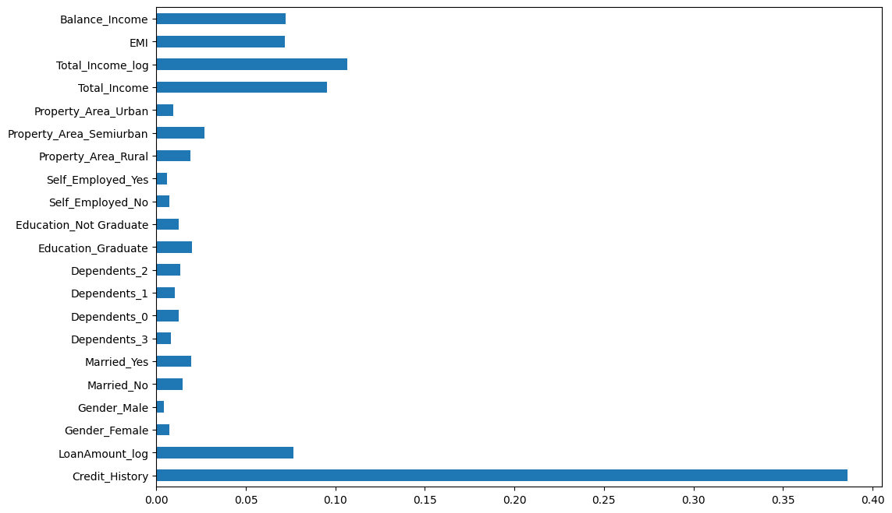
Credit_History emerges as the most crucial feature, closely followed by Balance Income, Total Income, and EMI. This underscores the significance of feature engineering in enhancing our predictive capabilities for the target variable.

# MODEL 5. GRADUATE / NOT GRADUATE MODEL(RANDOM FOREST CLASSIFIER)
```python
graduate_data = train[train['Education_Graduate'] == 1]
not_graduate_data = train[train['Education_Not Graduate'] ==1]

# Preprocess data for graduate customer
X_graduate = graduate_data.drop(columns=['Loan_Status'])
y_graduate = graduate_data['Loan_Status']

# Preprocess data for not-graduate customer
X_not_graduate = not_graduate_data.drop(columns=['Loan_Status'])
y_not_graduate = not_graduate_data['Loan_Status']

# Train model for graduate customers
model_graduate = RandomForestClassifier(random_state=1, max_depth=10)
model_graduate.fit(X_graduate, y_graduate)

# Train model for not-graduate customers
model_not_graduate = RandomForestClassifier(random_state=1, max_depth=10)
model_not_graduate.fit(X_not_graduate, y_not_graduate)

pred_test_graduate = model_graduate.predict(test[test['Education_Graduate'] == 1])


pred_test_not_graduate = model_not_graduate.predict(test[test['Education_Not Graduate'] == 1])

```
This code separates the training data into two groups based on whether the applicant is a graduate or not. Then, it trains a random forest classifier for each group. Finally, it makes predictions on the test data separately for graduate and non-graduate applicants using the respective models.
# Model 6: GRADUATE / NOT GRADUATE MODEL(RANDOM FOREST CLASSIFIER) with optimized parameter
```python
model_graduate = RandomForestClassifier(random_state=5, max_depth=81)
model_not_graduate = RandomForestClassifier(random_state=5, max_depth=81)

cv_scores_graduate = cross_val_score(model_graduate, X_graduate, y_graduate, cv=5)
print("Cross-validation scores:", cv_scores_graduate)
print("Mean CV Scores:", cv_scores_graduate.mean())

cv_scores_not_graduate = cross_val_score(model_not_graduate, X_not_graduate, y_not_graduate, cv=5)
print("Cross-validation scores:", cv_scores_not_graduate)
print("Mean CV Scores:", cv_scores_not_graduate.mean())

model_graduate.fit(X_graduate,y_graduate)
pred_test_graduate = model_graduate.predict(test[test['Education_Graduate'] == 1])


model_not_graduate.fit(X_not_graduate,y_not_graduate)
pred_test_not_graduate = model_not_graduate.predict(test[test['Education_Not Graduate'] == 1])

```
```python
Cross-validation scores: [0.75       0.79166667 0.78125    0.8125     0.82291667]
Mean CV Scores: 0.7916666666666666
Cross-validation scores: [0.7037037  0.55555556 0.7037037  0.77777778 0.61538462]
Mean CV Scores: 0.6712250712250712
```
The average cross-validation score for the first set is approximately 79.17%, while for the second set, it's around 67.12%. This indicates the model's performance consistency across different folds of the data.
# MODEL 7. GRADUATE MODEL(GRADIENT BOOSTING CLASSIFIER) 
```python
# GradientBoostingClassifier_
model_graduate_gb = GradientBoostingClassifier(random_state=1, max_depth=5, n_estimators=81)


cv_scores_graduate_gb = cross_val_score(model_graduate_gb, X_graduate, y_graduate, cv=5)
print("Cross-validation scores:", cv_scores_graduate_gb)
print("Mean CV Scores:", cv_scores_graduate_gb.mean())
model_graduate_gb.fit(X_graduate,y_graduate)
```
```python
Cross-validation scores: [0.73958333 0.76041667 0.79166667 0.82291667 0.79166667]
Mean CV Scores: 0.7812499999999999
```
```python
from sklearn.metrics import accuracy_score, precision_score, recall_score, f1_score, roc_auc_score
from sklearn.model_selection import cross_val_predict

# Cross-validation scores
cv_scores_graduate_gb = cross_val_score(model_graduate_gb, X_graduate, y_graduate, cv=5)
print("Cross-validation scores:", cv_scores_graduate_gb)
print("Mean CV Score:", cv_scores_graduate_gb.mean())

# Fit the model and make predictions
model_graduate_gb.fit(X_graduate, y_graduate)
y_pred = model_graduate_gb.predict(X_graduate)

# Evaluation metrics
accuracy = accuracy_score(y_graduate, y_pred)
precision = precision_score(y_graduate, y_pred)
recall = recall_score(y_graduate, y_pred)
f1 = f1_score(y_graduate, y_pred)
roc_auc = roc_auc_score(y_graduate, y_pred)

print("Accuracy:", accuracy)
print("Precision:", precision)
print("Recall:", recall)
print("F1 Score:", f1)
print("ROC AUC Score:", roc_auc)

# Confusion matrix
from sklearn.metrics import confusion_matrix
conf_matrix = confusion_matrix(y_graduate, y_pred)
print("Confusion Matrix:")
print(conf_matrix)

```
```python
Cross-validation scores: [0.73958333 0.76041667 0.79166667 0.82291667 0.79166667]
Mean CV Score: 0.7812499999999999
Accuracy: 0.9833333333333333
Precision: 0.9770114942528736
Recall: 1.0
F1 Score: 0.9883720930232558
ROC AUC Score: 0.9714285714285714
Confusion Matrix:
[[132   8]
 [  0 340]]
```
The GradientBoostingClassifier model trained on graduate data achieved a mean cross-validation score of approximately 78.12%. Upon fitting the model, it demonstrated high accuracy (98.33%), precision (97.70%), recall (100%), and F1 score (98.84%). The ROC AUC score was 97.14%, with a confusion matrix showing 132 true negatives, 8 false positives, 0 false negatives, and 340 true positives.
# Model 8:NOT GRADUATE Model(GradientBoostingClassifier)
```python
from sklearn.metrics import accuracy_score, precision_score, recall_score, f1_score, roc_auc_score
from sklearn.model_selection import cross_val_predict

# Cross-validation scores
cv_scores_not_graduate_gb = cross_val_score(model_not_graduate_gb, X_not_graduate, y_not_graduate, cv=5)
print("Cross-validation scores:", cv_scores_not_graduate_gb)
print("Mean CV Scores:", cv_scores_not_graduate_gb.mean())

# Fit the model and make predictions
model_not_graduate_gb.fit(X_not_graduate, y_not_graduate)
y_pred_not_graduate = model_not_graduate_gb.predict(X_not_graduate)

# Evaluation metrics
accuracy_not_graduate = accuracy_score(y_not_graduate, y_pred_not_graduate)
precision_not_graduate = precision_score(y_not_graduate, y_pred_not_graduate)
recall_not_graduate = recall_score(y_not_graduate, y_pred_not_graduate)
f1_not_graduate = f1_score(y_not_graduate, y_pred_not_graduate)
roc_auc_not_graduate = roc_auc_score(y_not_graduate, y_pred_not_graduate)

print("Accuracy:", accuracy_not_graduate)
print("Precision:", precision_not_graduate)
print("Recall:", recall_not_graduate)
print("F1 Score:", f1_not_graduate)
print("ROC AUC Score:", roc_auc_not_graduate)

# Confusion matrix
from sklearn.metrics import confusion_matrix
conf_matrix_not_graduate = confusion_matrix(y_not_graduate, y_pred_not_graduate)
print("Confusion Matrix:")
print(conf_matrix_not_graduate)

```

```python
Cross-validation scores: [0.74074074 0.59259259 0.77777778 0.66666667 0.57692308]
Mean CV Scores: 0.6709401709401709
Accuracy: 1.0
Precision: 1.0
Recall: 1.0
F1 Score: 1.0
ROC AUC Score: 1.0
Confusion Matrix:
[[52  0]
 [ 0 82]]
```
The GradientBoostingClassifier model trained on non-graduate data achieved a mean cross-validation score of approximately 67.09%. Upon fitting the model, it demonstrated perfect accuracy, precision, recall, and F1 score, all at 100%. The ROC AUC score was also 100%, with a confusion matrix showing 52 true negatives, 0 false positives, 0 false negatives, and 82 true positives.
# Conclusion
In conclusion, 

The performance of the models differed between graduate and non-graduate data. While the model trained on non-graduate data achieved perfect performance metrics across accuracy, precision, recall, and F1 score, the model trained on graduate data also showed high performance but with slight variations. Despite these differences, both models demonstrated strong predictive capability, indicating their effectiveness in distinguishing between loan approvals and rejections.

# Future Enhance
There are several ways to explore further in order to enhance the predictive performance of our models:

- Consider aggregating applicants with varying numbers of dependents to create a new feature, as highlighted in the Exploratory Data Analysis (EDA) section.
  
- Explore additional visualizations comparing independent and dependent variables to uncover potential patterns.
  
- Refine the calculation of Equated Monthly Installment (EMI) by incorporating interest rates for a more accurate estimation.
  
- Experiment with ensemble modeling techniques, combining diverse models to potentially improve predictive outcomes.


